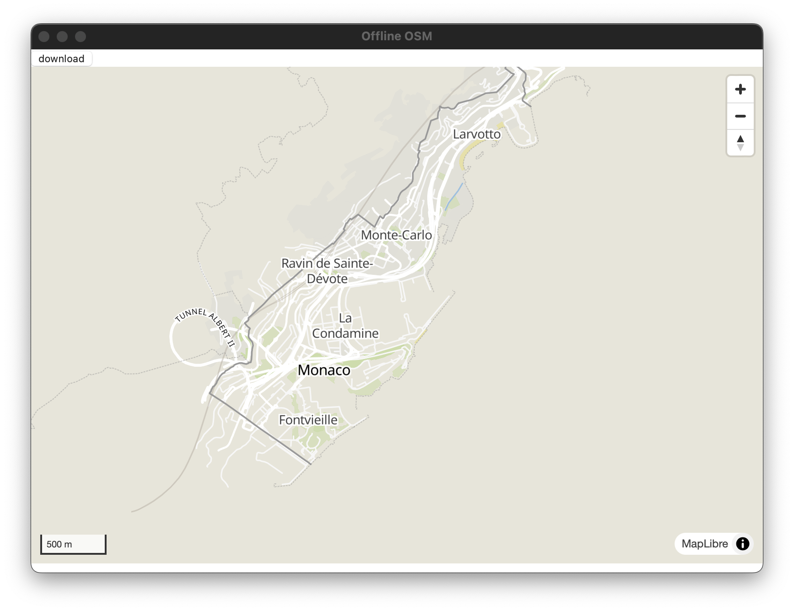

# Tauri Offline Maps

This is a proof-of-concept for building an offline maps app with Tauri and maplibregl

This is meant to prove the workflow for building something like Organic Maps:

- [] A user can download maps via:
  - [] A static list
  - [] Scrolling on the map on some zoom levels will expose download links for viewable regions
- [x] Downloaded maps are displayed offline

Stretch Goals

- [] An initial map of world coasts is included
- [] Report download progress

## Technologies

For this app, we will be using:

- pmtiles - The ability to run maplibregl from static files simplifies the process on the client (we can run downloaded pmtiles without additional processing)
- geofabrik - we are using this for region definition, `oms.pbf` files, and `.poly` files

## Tiles

Tiles are generated via:

- download `.osm.pbf` from geofabrik
- `tilemaker thailand-latest.osm.pbf thailand.pmtiles`, using `config-openmaptiles.json` and `process.openmaptiles.lua`
